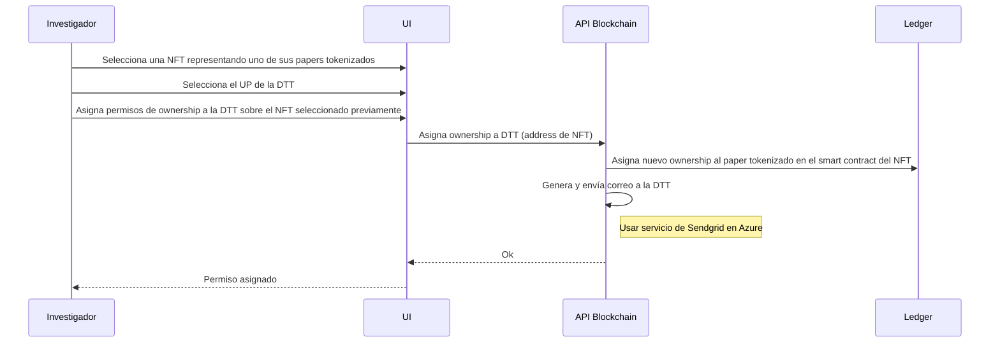
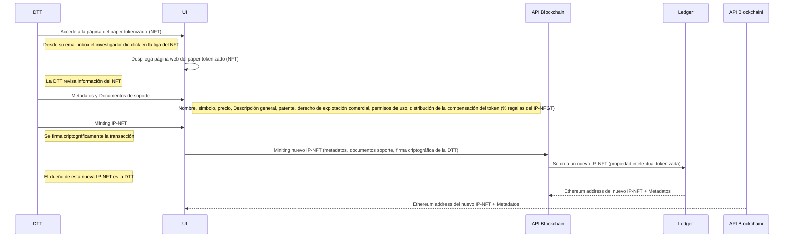
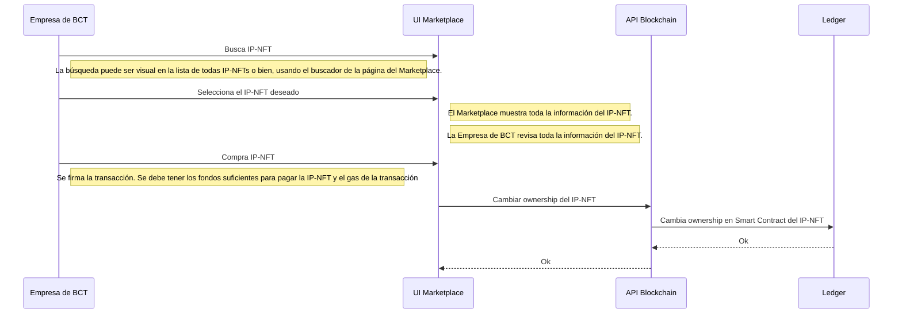

# IPNFT-Token: Tokenización de la Propiedad Intelectual
Tokenización de la Propiedad Intelectual

## Perfiles de Investigadores y Empresas de BCT
Actores que podrán interactuar con este módulo:
- Investigadores
- Empresas de BCT, y
- DTT

Este módulo es una aplicación web en dónde los actores podrán crear su perfil y en dónde podrán, a través del proceso de *minting*, podrán tokenizar sus papers para que estén representados por un **NFT**. Durante el proceso del *minting*, al **NFT** se le asignara un nombre, un símbolo que lo represente, una imagen y por supuesto el PDF del paper.

Los papers tokenizados y encapsulados en un **NFT** serán almacenados en una bóveda, es decir en un smart contract que cumple la función de resguardos de activos, y que solo a través del otorgamiento de permisos a ciertas cuentas (Ethereum address) se podrá acceder al activo y a su metadata, es decir al **NFT** que representa al paper tokenizado. Para la prueba de concepto a construir, la Ethereum address que recibirá el permiso de acceso al **NFT** será la que represente a la **DTT**. Toda está funcionalidad es posible gracias al uso de **NFT 2.0** y el estándar **ERC173**.

Los actores podrán incorporar una imagen o foto en su perfil, y hacer una descripción de actividad profesional.

### Diagrama de Secuencia: Crea Universal Profile

### Diagrama de Secuencia: Login

### Diagrama de Secuencia: Logout

### Diagrama de Secuencia: Tokeniza Paper (NFT)

## Tokenización de Propiedad Intelectual
Actores que podrán interactuar con este módulo:
- **Investigadores y Empresas de BCT**, actuando como los creadores del conocimiento
base a partir de uno o más papers, y
- **DTT**, actuando como la dueña de la propiedad intelectual a ser tokenizada, a partir del conocimiento base encapsulado en un NFT.

La **DTT** accederá al **NFT** que representa el paper tokenizado, esto debido al permiso concedido a la **DTT**, por el **investigador** o la **empresa de BCT**. Y deberá realizar lo siguiente:
- Hacer el minting de un nuevo **NFT** al cuál llamaremos **IP-NFT**, a partir del **NFT** que representa el conocimiento base (paper tokenizado por el investigador), y adicionarle nuevos metadatos:
    - Descripción general.
    - El documento legal que representa la patente. De esta manera se relaciona
el conocimiento base con la patente.
    - El documento legal en dónde se otorga o cede el derecho de explotación
comercial del **investigador** o la **Empresa de BCT** a la **DTT**.
    - Documento legal que le otorga al comprador de la IP-NFT, permisos de uso
permanente y no exclusiva.
    - Asignación del precio comercial de la **IP-NFT**
    - Asignación de los porcentajes a repartir cuando
se comercialice la **IP-NFT**:
        - Porcentaje de regalías que se le concede al **investigador** o a la
**Empresa de BCT** por *derecho de explotación del conocimiento base a través de la comercialización de la patente*.
        - El porcentaje de la comisión al protocolo.
        - El porcentaje de aportación a la DAO.
        - El porcentaje de regalías que se le concederán a la **DTT**.
- El proceso de minting del **IP-NFT** deberá ser firmado criptográficamente tanto por la **DTT** y el **investigador** o la **Empresa de BCT**.
    - Esto se debe a que existe una cesión de derechos de explotación comercial.

### Diagrama de Secuencia: Asignación de Permisos sobre NFT (Paper Tokenizado)

### Diagrama de Secuencia: Tokenización Propiedad Intelectual

## Marketplace de Propiedad Intelectual Tokenizada
Actores que podrán interactuar con este módulo:
- Cualquier persona que cree su perfil

Este módulo funcional será una aplicación web, en dónde se desplegarán todas las **IP-NFT** con una descripción corta y su nombre, así como el precio.

El actor deberá tener en su wallet suficiente cryptos para pagar la IP-NFT y el gas asociado a la transacción.

La transacción de compra de un IP-NFT deberá ser firmada criptográficamente.

### Diagrama de Secuencia: Busqueda y compra de IP-NFT
